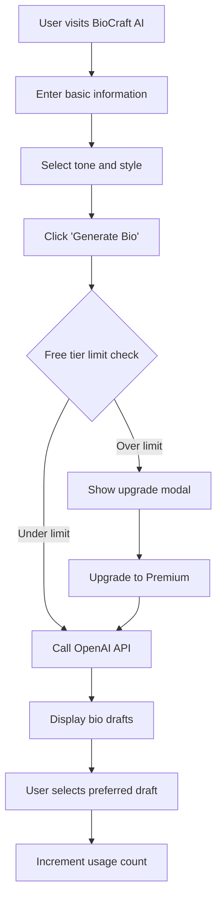
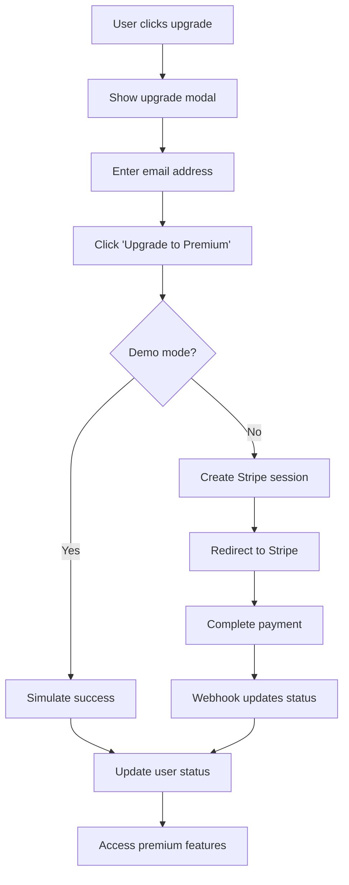
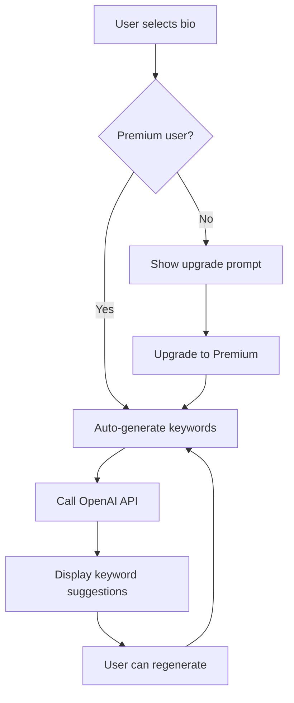

# BioCraft AI Technical Specifications

## 📋 Overview

BioCraft AI is a modern web application built with React and Vite that leverages AI to generate optimized LinkedIn bios. This document outlines the complete technical architecture, data models, API specifications, and implementation details.

## 🏗️ System Architecture

### Frontend Architecture

```
┌─────────────────────────────────────────────────────────────┐
│                    BioCraft AI Frontend                     │
├─────────────────────────────────────────────────────────────┤
│  React 18 + Vite + Tailwind CSS + Lucide Icons           │
├─────────────────────────────────────────────────────────────┤
│                    Component Layer                          │
│  ┌─────────────┐ ┌─────────────┐ ┌─────────────┐          │
│  │  AppShell   │ │ BioInputForm│ │ BioResults  │          │
│  └─────────────┘ └─────────────┘ └─────────────┘          │
│  ┌─────────────┐ ┌─────────────┐ ┌─────────────┐          │
│  │UpgradeModal │ │SelectDropdown│ │   Button    │          │
│  └─────────────┘ └─────────────┘ └─────────────┘          │
├─────────────────────────────────────────────────────────────┤
│                    State Management                         │
│  ┌─────────────────────────────────────────────────────┐   │
│  │              AppContext (React Context)             │   │
│  │  - User State    - Bio Profile    - UI State       │   │
│  └─────────────────────────────────────────────────────┘   │
├─────────────────────────────────────────────────────────────┤
│                    Service Layer                            │
│  ┌─────────────┐ ┌─────────────┐ ┌─────────────┐          │
│  │   OpenAI    │ │   Stripe    │ │ LocalStorage│          │
│  │  Service    │ │  Service    │ │   Service   │          │
│  └─────────────┘ └─────────────┘ └─────────────┘          │
└─────────────────────────────────────────────────────────────┘
```

### External Integrations

```
┌─────────────────┐    ┌─────────────────┐    ┌─────────────────┐
│   BioCraft AI   │    │   OpenAI API    │    │   Stripe API    │
│   Frontend      │◄──►│   (Gemini 2.0)  │    │   (Payments)    │
└─────────────────┘    └─────────────────┘    └─────────────────┘
         │
         ▼
┌─────────────────┐
│  Browser        │
│  LocalStorage   │
└─────────────────┘
```

## 📊 Data Models

### User Entity

```typescript
interface User {
  userId: string;
  email: string;
  subscriptionStatus: 'free' | 'premium';
  createdAt: Date | null;
  usageCount: number;
  lastResetDate: string;
}
```

**Attributes:**
- `userId`: Unique identifier for the user
- `email`: User's email address
- `subscriptionStatus`: Current subscription tier
- `createdAt`: Account creation timestamp
- `usageCount`: Daily bio generation count (free tier)
- `lastResetDate`: Last usage reset date (daily)

**Relationships:**
- One-to-many with BioProfile

### BioProfile Entity

```typescript
interface BioProfile {
  profileId: string;
  userId: string;
  userInput: UserInput;
  generatedBioDrafts: string[];
  selectedBio: string;
  keywords: string[];
  optimizedBio?: string;
  tone: ToneType;
  createdAt: Date;
  updatedAt: Date;
}

interface UserInput {
  jobTitle: string;
  industry: string;
  experience: string;
  skills: string;
  goals: string;
  tone: ToneType;
}

type ToneType = 'professional' | 'creative' | 'enthusiastic' | 'authoritative' | 'friendly';
```

**Attributes:**
- `profileId`: Unique identifier for the bio profile
- `userId`: Reference to the user
- `userInput`: User-provided information
- `generatedBioDrafts`: AI-generated bio variations
- `selectedBio`: User's chosen bio
- `keywords`: AI-suggested keywords
- `optimizedBio`: Premium optimized version
- `tone`: Selected tone/style
- `createdAt`: Profile creation timestamp
- `updatedAt`: Last modification timestamp

**Relationships:**
- Belongs to User

## 🔄 User Flows

### 1. User Onboarding & Bio Generation



### 2. Premium Subscription Upgrade



### 3. Keyword Optimization Flow



## 🎨 Design System

### Color Palette

```css
:root {
  /* Primary Colors */
  --color-bg: hsl(220, 15%, 98%);
  --color-text: hsl(220, 15%, 20%);
  --color-muted: hsl(220, 15%, 50%);
  --color-accent: hsl(160, 80%, 50%);
  --color-primary: hsl(215, 80%, 50%);
  --color-surface: hsl(0, 0%, 100%);
  
  /* Dark Theme */
  --color-dark-bg: hsl(230, 35%, 7%);
  --color-dark-surface: hsl(230, 30%, 12%);
  --color-dark-text: hsl(220, 15%, 95%);
  --color-dark-muted: hsl(220, 15%, 60%);
  
  /* Gradients */
  --gradient-start: hsl(240, 80%, 20%);
  --gradient-end: hsl(210, 80%, 40%);
}
```

### Typography Scale

```css
/* Typography Tokens */
.text-display {
  font-size: 3rem;
  font-weight: 700;
  line-height: 1.2;
}

.text-heading {
  font-size: 1.875rem;
  font-weight: 600;
  line-height: 1.3;
}

.text-subheading {
  font-size: 1.25rem;
  font-weight: 500;
  line-height: 1.4;
}

.text-body {
  font-size: 1rem;
  font-weight: 400;
  line-height: 1.75;
}

.text-caption {
  font-size: 0.875rem;
  font-weight: 400;
  line-height: 1.5;
}
```

### Spacing System

```css
/* Spacing Tokens */
:root {
  --space-sm: 8px;
  --space-md: 12px;
  --space-lg: 16px;
  --space-xl: 20px;
  --space-xxl: 24px;
}
```

### Component Specifications

#### Button Component

```typescript
interface ButtonProps {
  variant: 'primary' | 'secondary' | 'outline' | 'ghost';
  size: 'sm' | 'md' | 'lg';
  disabled?: boolean;
  loading?: boolean;
  icon?: React.ReactNode;
  children: React.ReactNode;
  onClick?: () => void;
}
```

**Variants:**
- `primary`: Main action button with primary color
- `secondary`: Secondary action with muted styling
- `outline`: Outlined button with transparent background
- `ghost`: Minimal button with no background

#### Card Component

```typescript
interface CardProps {
  variant: 'default' | 'elevated' | 'outlined';
  padding: 'sm' | 'md' | 'lg';
  children: React.ReactNode;
  className?: string;
}
```

**Features:**
- Glass morphism effect with backdrop blur
- Consistent border radius and shadows
- Responsive padding system

#### InputField Component

```typescript
interface InputFieldProps {
  type: 'text' | 'email' | 'password' | 'textarea';
  label?: string;
  placeholder?: string;
  value: string;
  onChange: (value: string) => void;
  error?: string;
  disabled?: boolean;
  required?: boolean;
}
```

## 🔌 API Requirements

### OpenAI Integration

**Purpose:** Generate custom LinkedIn bio drafts and keyword suggestions

**Configuration:**
```javascript
const openai = new OpenAI({
  apiKey: import.meta.env.VITE_OPENAI_API_KEY,
  baseURL: "https://openrouter.ai/api/v1",
  dangerouslyAllowBrowser: true,
});
```

**Models Used:**
- Primary: `google/gemini-2.0-flash-001`
- Fallback: Demo data when API unavailable

**Rate Limits:**
- Free tier: 3 requests per day
- Premium tier: Unlimited

### Stripe Integration

**Purpose:** Process subscription payments and manage billing

**Configuration:**
```javascript
const stripePromise = loadStripe(
  import.meta.env.VITE_STRIPE_PUBLISHABLE_KEY
);
```

**Products:**
- Premium Monthly: $15/month
- One-time Bio Optimization: $25
- Keyword Analysis: $5

**Webhook Events:**
- `subscription.created`
- `subscription.updated`
- `subscription.deleted`
- `payment_intent.succeeded`

## 🔒 Security Implementation

### Data Protection

1. **Client-side Storage:**
   - Only non-sensitive data in localStorage
   - No API keys or payment information stored
   - Automatic data cleanup on logout

2. **API Security:**
   - Environment variables for sensitive keys
   - HTTPS-only communication
   - Input validation and sanitization

3. **Payment Security:**
   - PCI DSS compliant via Stripe
   - No card data touches our servers
   - Secure webhook signature validation

### Error Handling

```typescript
interface ErrorState {
  code: string;
  message: string;
  details?: any;
  timestamp: Date;
}

// Error types
type ErrorCode = 
  | 'USAGE_LIMIT_EXCEEDED'
  | 'API_ERROR'
  | 'NETWORK_ERROR'
  | 'VALIDATION_ERROR'
  | 'PAYMENT_ERROR';
```

## 📱 Responsive Design

### Breakpoints

```css
/* Tailwind CSS Breakpoints */
sm: 640px   /* Small devices */
md: 768px   /* Medium devices */
lg: 1024px  /* Large devices */
xl: 1280px  /* Extra large devices */
2xl: 1536px /* 2X large devices */
```

### Mobile-First Approach

- Base styles for mobile (320px+)
- Progressive enhancement for larger screens
- Touch-friendly interface elements
- Optimized for thumb navigation

### Accessibility Features

1. **WCAG 2.1 AA Compliance:**
   - Semantic HTML structure
   - Proper heading hierarchy
   - Alt text for images
   - Keyboard navigation support

2. **Screen Reader Support:**
   - ARIA labels and descriptions
   - Focus management
   - Live regions for dynamic content

3. **Color Accessibility:**
   - High contrast ratios (4.5:1 minimum)
   - Color-blind friendly palette
   - No color-only information

## ⚡ Performance Optimization

### Bundle Optimization

```javascript
// Vite configuration for optimization
export default defineConfig({
  build: {
    rollupOptions: {
      output: {
        manualChunks: {
          vendor: ['react', 'react-dom'],
          ui: ['lucide-react', '@radix-ui/react-select'],
          services: ['openai', '@stripe/stripe-js']
        }
      }
    }
  }
});
```

### Loading Strategies

1. **Code Splitting:**
   - Route-based splitting
   - Component lazy loading
   - Dynamic imports for heavy libraries

2. **Asset Optimization:**
   - Image compression and WebP format
   - Font subsetting and preloading
   - CSS purging and minification

3. **Caching Strategy:**
   - Service worker for offline support
   - Browser caching for static assets
   - API response caching where appropriate

## 🧪 Testing Strategy

### Unit Testing

```javascript
// Example test structure
describe('BioInputForm', () => {
  it('validates required fields', () => {
    // Test implementation
  });
  
  it('handles form submission', () => {
    // Test implementation
  });
  
  it('shows usage limits for free users', () => {
    // Test implementation
  });
});
```

### Integration Testing

- API integration tests
- Payment flow testing
- User journey testing
- Cross-browser compatibility

### Performance Testing

- Lighthouse audits
- Core Web Vitals monitoring
- Load testing for API endpoints
- Memory leak detection

## 🚀 Deployment Architecture

### Build Process

```bash
# Production build
npm run build

# Build artifacts
dist/
├── index.html
├── assets/
│   ├── index-[hash].js
│   ├── index-[hash].css
│   └── vendor-[hash].js
└── health.json
```

### Environment Configuration

```bash
# Production environment variables
VITE_OPENAI_API_KEY=sk-...
VITE_STRIPE_PUBLISHABLE_KEY=pk_...
NODE_ENV=production
```

### CDN Strategy

1. **Static Assets:** Served via CDN
2. **Cache Headers:** Long-term caching for versioned assets
3. **Compression:** Gzip/Brotli compression enabled
4. **Geographic Distribution:** Multi-region deployment

## 📊 Monitoring & Analytics

### Application Metrics

1. **Performance Metrics:**
   - Page load times
   - API response times
   - Bundle size tracking
   - Core Web Vitals

2. **Business Metrics:**
   - Bio generation count
   - Conversion rates
   - User retention
   - Feature usage

3. **Error Tracking:**
   - JavaScript errors
   - API failures
   - Payment issues
   - User-reported bugs

### Health Monitoring

```json
{
  "status": "healthy",
  "checks": {
    "openai": "operational",
    "stripe": "operational",
    "database": "operational"
  },
  "metrics": {
    "responseTime": "120ms",
    "uptime": "99.9%",
    "errorRate": "0.1%"
  }
}
```

## 🔄 State Management

### Context Structure

```typescript
interface AppState {
  user: UserState;
  bioProfile: BioProfileState;
  ui: UIState;
}

interface UserState {
  email: string;
  subscriptionStatus: 'free' | 'premium';
  usageCount: number;
  lastResetDate: string;
}

interface BioProfileState {
  userInput: UserInput;
  generatedBioDrafts: string[];
  selectedBio: string;
  keywords: string[];
  isGenerating: boolean;
  error: string | null;
}

interface UIState {
  showUpgradeModal: boolean;
  currentStep: 'input' | 'results';
}
```

### Action Types

```typescript
type AppAction = 
  | { type: 'UPDATE_USER_INPUT'; payload: Partial<UserInput> }
  | { type: 'SET_GENERATING'; payload: boolean }
  | { type: 'SET_BIO_DRAFTS'; payload: string[] }
  | { type: 'SET_ERROR'; payload: string | null }
  | { type: 'SELECT_BIO'; payload: string }
  | { type: 'SET_KEYWORDS'; payload: string[] }
  | { type: 'INCREMENT_USAGE' }
  | { type: 'RESET_USAGE' }
  | { type: 'UPGRADE_USER' }
  | { type: 'TOGGLE_UPGRADE_MODAL' };
```

## 📈 Scalability Considerations

### Frontend Scaling

1. **Code Organization:**
   - Modular component architecture
   - Reusable utility functions
   - Consistent naming conventions

2. **Performance Scaling:**
   - Virtual scrolling for large lists
   - Debounced API calls
   - Optimistic UI updates

3. **Feature Scaling:**
   - Feature flags for gradual rollouts
   - A/B testing infrastructure
   - Modular feature architecture

### Infrastructure Scaling

1. **CDN Distribution:**
   - Global edge locations
   - Automatic failover
   - Dynamic content caching

2. **API Scaling:**
   - Rate limiting implementation
   - Request queuing
   - Circuit breaker patterns

3. **Database Scaling:**
   - Read replicas for analytics
   - Horizontal partitioning
   - Caching layers

This technical specification provides a comprehensive overview of the BioCraft AI implementation, covering all aspects from architecture to deployment. The system is designed to be scalable, maintainable, and user-friendly while providing robust AI-powered functionality for LinkedIn bio generation.
